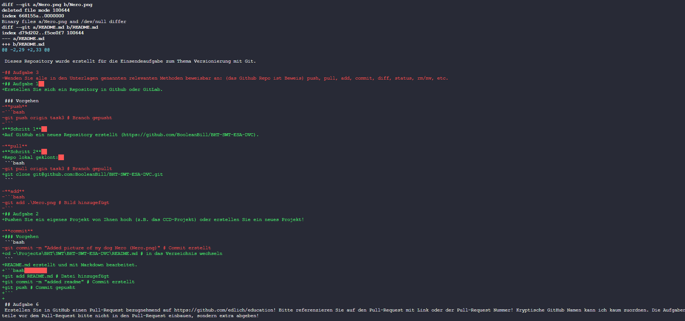

# BHT Softwaretechnik Kurs

Dieses Repository wurde erstellt für die Einsendeaufgabe zum Thema Versionierung mit Git.

## Aufgabe 3
Wenden Sie alle in den Unterlagen genannten relevanten Methoden beweisbar an: (das Github Repo ist Beweis) push, pull, add, commit, diff, status, rm/mv, etc.

### Vorgehen
#### push
```bash
git push origin task3 # Branch gepusht
```
---
#### pull
```bash
git pull origin task3 # Branch gepullt
```
---
#### add
```bash
git add .\Nero.png # Bild hinzugefügt
```
---
#### commit
```bash
git commit -m "Added picture of my dog Nero (Nero.png)" # Commit erstellt
```
---
#### diff
```bash
git diff # Änderungen angezeigt
git diff task3 task1 # Änderungen zwischen Branches angezeigt
```
**Ausgabe (Screenshot Ausschnitt)**

---
#### status
```bash
git status # Status angezeigt
```
**Ausgabe**
```bash
PS C:\Users\freak\Projects\BHT\SWT\BHT-SWT-ESA-DVC> git status
On branch task3
Your branch is up to date with 'origin/task3'.

Changes not staged for commit:
  (use "git add <file>..." to update what will be committed)
  (use "git restore <file>..." to discard changes in working directory)
        modified:   README.md

no changes added to commit (use "git add" and/or "git commit -a")
``` 
---
#### rm/mv
```bash
git mv .\Nero.png .\Images\ # Bild verschoben
```
## Aufgabe 6
Erstellen Sie in GitHub einen Pull-Request bezugnehmend auf https://github.com/edlich/education! Bitte referenzieren Sie auf den Pull-Request mit Link oder der Pull-Request Nummer! Kryptische GitHub Namen kann ich kaum zuordnen. Die Aufgabenteile vor dem Pull-Request bitte nicht in den Pull-Request einbauen, sondern extra abgeben!


### Vorgehen
**Schritt 1**  
Fork vom Repository erstellt (https://github.com/BooleanBill/education). 

**Schritt 2**  
```bash
git clone git@github.com:BooleanBill/education.git # Repository geklont
cd education # in das Verzeichnis wechseln
git checkout -b klejewski-esa-dvc # Branch erstellt
cp ~/Pictures/Nero.png ~/Projects/BHT/SWT/education/Pet-Folder # Bild kopiert
git add Pet-Folder/Nero.png # Bild hinzugefügt
git commit -m "Added picture of my dog Nero (Nero.png)" # Commit erstellt
git push origin klejewski-esa-dvc # Branch gepusht
```

**Schritt 3**  
Pull-Request erstellt (https://github.com/edlich/education/pull/489)