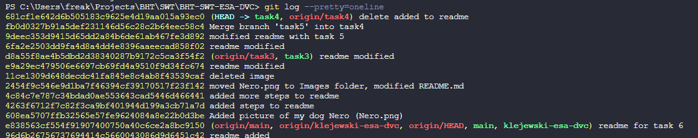
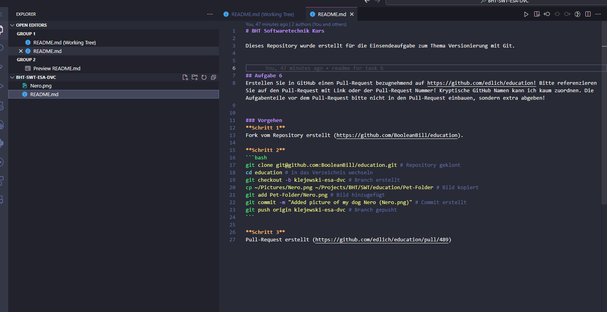

# BHT Softwaretechnik Kurs

Dieses Repository wurde erstellt für die Einsendeaufgabe zum Thema Versionierung mit Git.

## Aufgabe 3
Wenden Sie alle in den Unterlagen genannten relevanten Methoden beweisbar an: (das Github Repo ist Beweis) push, pull, add, commit, diff, status, rm/mv, etc.

### Vorgehen
#### push
```bash
git push origin task3 # Branch gepusht
```
---
#### pull
```bash
git pull origin task3 # Branch gepullt
```
---
#### add
```bash
git add .\Nero.png # Bild hinzugefügt
```
---
#### commit
```bash
git commit -m "Added picture of my dog Nero (Nero.png)" # Commit erstellt
```
---
#### diff
```bash
git diff # Änderungen angezeigt
git diff task3 task1 # Änderungen zwischen Branches angezeigt
```
**Ausgabe (Screenshot Ausschnitt)**

---
#### status
```bash
git status # Status angezeigt
```
**Ausgabe**
```bash
PS C:\Users\freak\Projects\BHT\SWT\BHT-SWT-ESA-DVC> git status
On branch task3
Your branch is up to date with 'origin/task3'.

Changes not staged for commit:
  (use "git add <file>..." to update what will be committed)
  (use "git restore <file>..." to discard changes in working directory)
        modified:   README.md

no changes added to commit (use "git add" and/or "git commit -a")
``` 
---
#### rm/mv
```bash
git mv .\Nero.png .\Images\ # Bild verschoben
git rm .\Images\Nero.png # Bild gelöscht
```

#### log
```bash
git log # Log angezeigt
```
**Ausgabe**  
```bash
PS C:\Users\freak\Projects\BHT\SWT\BHT-SWT-ESA-DVC> git log
commit 11ce1309d648decdc41fa845e8c4ab8f43539caf (HEAD -> task3, origin/task3)
Author: Martin <martin.klejewski@gmail.com>
Date:   Sat Dec 30 09:32:39 2023 +0100

    deleted image

commit 2454f9c546e9d1ba7f46394cf39170517f23f142
Author: Martin <martin.klejewski@gmail.com>
Date:   Sat Dec 30 09:31:51 2023 +0100

    moved Nero.png to Images folder, modified README.md

commit 4c84c7e787c34bdad0ae553643cad5446d466441
Author: Martin <martin.klejewski@gmail.com>
Date:   Sat Dec 30 09:30:35 2023 +0100

    added more steps to readme

commit 4263f6712f7c82f3ca9bf401944d199a3cb71a7d
Author: Martin <martin.klejewski@gmail.com>
Date:   Sat Dec 30 09:23:17 2023 +0100

    added steps to readme

commit 608ea5707ffb32565e57fe9624084a8e22b0d3be
Author: Martin <martin.klejewski@gmail.com>
Date:   Sat Dec 30 09:22:08 2023 +0100

    Added picture of my dog Nero (Nero.png)

commit e838563cf554f91907400750a40c6ce2a8bc9150 (origin/main, origin/klejewski-esa-dvc, origin/HEAD, main, klejewski-esa-dvc)
Author: Martin <martin.klejewski@gmail.com>
Date:   Sat Dec 30 09:03:21 2023 +0100

    readme for task 6

commit 96d6b26756737694414c5660043086d9d6451c42
Author: Martin Klejewski <m.klejewski@ovan.de>
Date:   Thu Dec 14 08:55:13 2023 +0100

    readme added
``` 
---
#### branch
```bash
git branch # Branches angezeigt
```
**Ausgabe**
```bash
PS C:\Users\freak\Projects\BHT\SWT\BHT-SWT-ESA-DVC> git branch
  klejewski-esa-dvc
  main
  task1
  task2
* task3
```
---
#### checkout
```bash
git checkout task1 # Branch gewechselt
git checkout -b task4 # Branch erstellt und gewechselt
```
---

### delete branch
```bash
git branch -d task5 # Branch gelöscht
```

## delete remote branch
```bash
git push origin --delete task5 # Branch auf remote gelöscht
```

## Aufgabe 4
Experimentieren Sie mit Zeitreisen!


### Vorgehen
**ältere commits anzeigen**
```bash
git log --pretty=oneline # alle commits anzeigen
```
**Ausgabe (Screenshot 2)**


**zum älteren commit wechseln**
```bash
git checkout 608ea5707ffb32565e57fe9624084a8e22b0d3be # zu einem älteren commit wechseln
```

**Ausgabe**  
```bash
PS C:\Users\freak\Projects\BHT\SWT\BHT-SWT-ESA-DVC> git checkout 608ea5707ffb32565e57fe9624084a8e22b0d3be
Note: switching to '608ea5707ffb32565e57fe9624084a8e22b0d3be'.

You are in 'detached HEAD' state. You can look around, make experimental
changes and commit them, and you can discard any commits you make in this
state without impacting any branches by switching back to a branch.

If you want to create a new branch to retain commits you create, you may
do so (now or later) by using -c with the switch command. Example:

  git switch -c <new-branch-name>

Or undo this operation with:

  git switch -

Turn off this advice by setting config variable advice.detachedHead to false

HEAD is now at 608ea57 Added picture of my dog Nero (Nero.png)
```

**Screenshots des älteren commits (Screenshot 3)**

## Aufgabe 5
Erstellen sie zwei unterschiedliche aber ähnliche Branches, wechseln sie hin und her und mergen sie diese Branches dann wieder!  
### Vorgehen
```bash
git checkout -b task4
git push --set-upstream origin task4
git checkout -b task5
git push --set-upstream origin task5
git checkout task4
git merge task5
```

## Aufgabe 6
Erstellen Sie in GitHub einen Pull-Request bezugnehmend auf https://github.com/edlich/education! Bitte referenzieren Sie auf den Pull-Request mit Link oder der Pull-Request Nummer! Kryptische GitHub Namen kann ich kaum zuordnen. Die Aufgabenteile vor dem Pull-Request bitte nicht in den Pull-Request einbauen, sondern extra abgeben!


### Vorgehen
**Schritt 1**  
Fork vom Repository erstellt (https://github.com/BooleanBill/education). 

**Schritt 2**  
```bash
git clone git@github.com:BooleanBill/education.git # Repository geklont
cd education # in das Verzeichnis wechseln
git checkout -b klejewski-esa-dvc # Branch erstellt
cp ~/Pictures/Nero.png ~/Projects/BHT/SWT/education/Pet-Folder # Bild kopiert
git add Pet-Folder/Nero.png # Bild hinzugefügt
git commit -m "Added picture of my dog Nero (Nero.png)" # Commit erstellt
git push origin klejewski-esa-dvc # Branch gepusht
```

**Schritt 3**  
Pull-Request erstellt (https://github.com/edlich/education/pull/489)